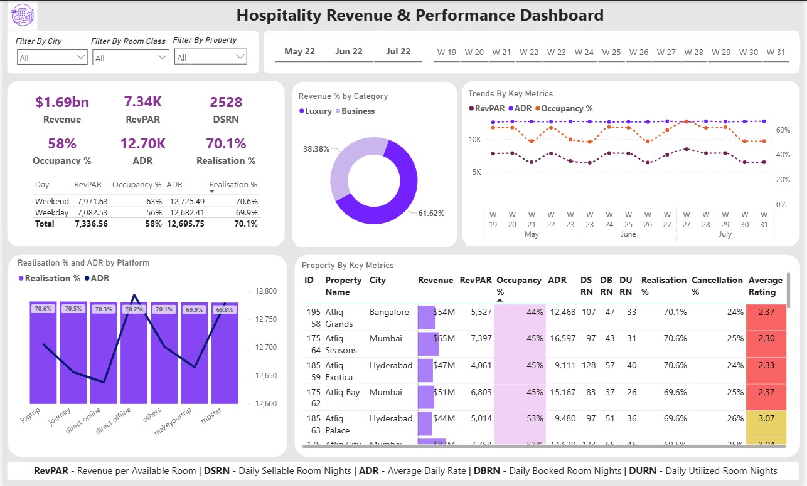

# Atliq Hotels — Revenue & Performance Dashboard

> **Power BI dashboard analysing hotel booking performance, revenue trends, and guest satisfaction across 7 properties.**

---

## Project Background (STAR Method)

| | |
|---|---|
| **Situation** | Atliq Grand, a multi-property five-star hotel chain, noticed a decline in market share and needed data-driven visibility into performance. |
| **Task** | Build an end-to-end interactive dashboard to help management make informed decisions on revenue, occupancy, and guest experience. |
| **Action** | Analysed 3 months of booking data in Power BI — built a star schema data model, created 20+ DAX measures, and designed an interactive dashboard with slicers, tooltips, and conditional formatting. |
| **Result** | Dashboard surfaces key insights: 58% occupancy leaving ₹5,360/room/night revenue on the table, 30% booking loss rate, and critically low guest ratings — giving management clear levers to act on. |

---

## Dashboard Preview



> *Filter by City · Room Class · Property · Month · Week*

---

## Key Insights Found

- **Occupancy at 58%** — 42 out of every 100 rooms are empty nightly, the single biggest revenue leak.
- **ADR (₹12,700) vs RevPAR (₹7,340)** — ₹5,360 gap is the direct cost of vacancy; pricing is healthy, demand is the problem.
- **30% bookings lost** — Realisation of 70.1% means cancellations and no-shows erode nearly a third of potential revenue.
- **Luxury drives 62% of revenue** — business hotels (38%) are a secondary contributor; luxury properties need priority protection.
- **Weekends outperform weekdays** — Weekend RevPAR ₹7,972 vs Weekday ₹7,083 (12% gap), signalling weak mid-week demand.
- **Guest ratings dangerously low** — Average ratings of 2.30–3.07/5 across properties; Atliq Grands Bangalore at only 2.37 with 44% occupancy.

---

## Tools & Skills Used

| Area | Detail |
|---|---|
| **Tool** | Microsoft Power BI Desktop. |
| **Data Modelling** | Star schema — 2 fact tables, 3 dimension tables. |
| **DAX Measures** | 20+ measures including Revenue, RevPAR, ADR, Occupancy %, Realisation %, DBRN, DSRN, DURN, Cancellation %, No Show rate % |
| **DAX Concepts** | CALCULATE, DIVIDE, ALL(), FILTER(), VAR |
| **Visualisations** | KPI cards, line charts, donut chart, clustered bar + line combo, matrix table with conditional formatting. |
| **UX Features** | Page-level slicers (City, Room Class, Property), timeline filter (Month + Week), custom tooltip pages on Revenue and RevPAR KPI cards. |

---

## Data Model

```
fact_bookings          ──┐
                         ├──▶ dim_hotels  (property_id)
fact_aggregated_bookings─┘──▶ dim_rooms   (room_category → room_id)
                              dim_date    (check_in_date → date)
```

**fact_bookings** — one row per booking (booking_id, status, platform, revenue, ratings)  
**fact_aggregated_bookings** — pre-summarised capacity & successful bookings by property/date/room  
**dim_hotels** — property name, city, category (Luxury/Business)  
**dim_rooms** — room class (Standard, Elite, Premium, Presidential)  
**dim_date** — date, day type (weekday/weekend), week number, month

---

## Key DAX Measures

```dax
-- Core metrics
Revenue           = SUM(fact_bookings[revenue_realized])
Occupancy %       = DIVIDE([Total Successful Bookings], [Total Capacity], 0)
ADR               = DIVIDE([Revenue], [Total Bookings], 0)
RevPAR            = DIVIDE([Revenue], [Total Capacity])
Realisation %     = 1 - ([Cancellation %] + [No Show rate %])

-- Booking % of total (uses ALL to clear filters)
Booking % by Platform = DIVIDE(
    [Total Bookings],
    CALCULATE([Total Bookings], ALL(fact_bookings[booking_platform]))
) * 100

---

## Business Recommendations

Based on dashboard findings, three priority actions for management:

1. **Fix weekday demand** — introduce corporate tie-ups, weekday pricing deals, or loyalty programme perks to close the 7pp gap vs weekends.
2. **Reduce cancellations** — implement stricter cancellation policies or refundable/non-refundable tiered pricing; 30% booking loss rate is significantly above industry norm.
3. **Urgently address guest experience** — ratings below 3.0 on OTA platforms directly reduce future organic bookings; prioritise Atliq Grands Bangalore (2.37 rating, 44% occupancy) for immediate quality review.

---

## Files in This Repository

| File | Description |
|---|---|
| `Data` | Raw Data |
| `Atliq_Hotels_Dashboard.pbix` | Power BI project file |
| `dashboard_preview.png` | Screenshot of final dashboard |
| `README.md` | This file |

---

## How to Open

1. Download and install [Power BI Desktop](https://powerbi.microsoft.com/desktop/) (free)
2. Clone or download this repository
3. Open `Atliq_Hotels_Dashboard.pbix` in Power BI Desktop
4. Use the slicers at the top to explore by city, room class, property, month, and week

---

By Shubham Bhakta

*Open to feedback, suggestions, and data analyst opportunities!*

---
